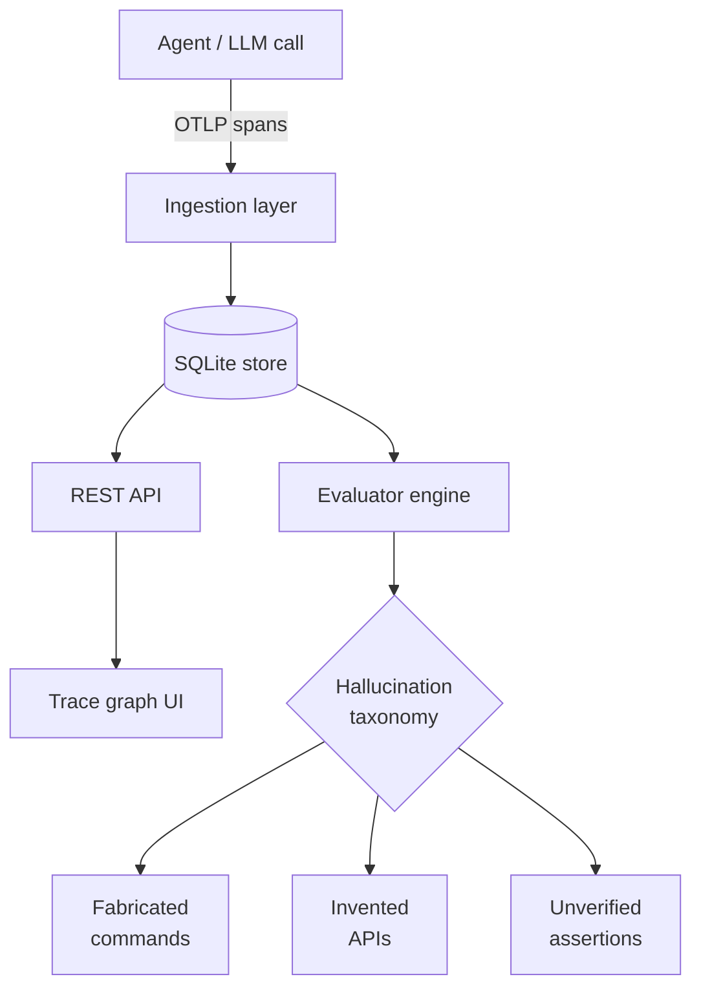

<div align="center">


<br/>

[](https://git.io/typing-svg)

[](https://github.com/abhishek09827)
[](https://www.linkedin.com/in/abhishek-kaushik-0a6a16243/)
[](https://abhibuilds.work)
[](https://ab-blog.hashnode.dev/)

</div>

<br/>

```bash
abhishek@dev:~$ cat about.md
```

Cloud Developer at **Hewlett Packard Enterprise**, building production Spark/Kafka
pipelines on Delta Lake - and, in the margins, an Applied AI portfolio focused on
agent evaluation, observability, and RAG infrastructure. I like systems that tell
you honestly when they're wrong.

```bash
abhishek@dev:~$ ls ~/currently-building/
```

```
anveshan/    → local-first OTLP trace ingestion + eval for AI agents  [ACTIVE]
```

---

## `// now-building`

<table>
<tr>
<td width="55%" valign="top">

**[Anveshan](https://github.com/abhishek09827/anveshan)** - agent trace evaluation, local-first

Most agent observability tools assume you'll ship traces to someone else's cloud.
Anveshan doesn't - SQLite + a REST layer keep the trace graph on your machine,
which matters once you're evaluating agents that touch sensitive systems.

- Schema extends OTLP with `session.id`, `conversation.id`, and
  `gen_ai.conversation.turn_count` - most tracing schemas assume one span = one
  isolated call, which breaks the moment an agent has a multi-turn conversation
- `prompt.source` (`human` | `agent` | `system`) - because a self-prompting agent
  and a human-initiated one need to be scored differently, not lumped together
- **Core bet:** a hallucination taxonomy - fabricated commands, invented APIs,
  unverified test assertions - as a first-class evaluation dimension, not an
  afterthought bolted onto latency/cost metrics
- Domain evaluator plugins (cybersecurity, financial) deliberately deferred to
  v2 until the base evaluator interface earns its keep

</td>
<td width="45%" valign="top">



</td>
</tr>
</table>

---

## `// system.log`

```bash
abhishek@dev:~$ tail -f hpe/experience.log
```

```
[Aug 2025 → present]  Cloud Developer I · HPE
  ├─ LLM audit pipeline          (AWS Bedrock + LangChain)
  ├─ Delta Lake migration        (AWS S3 + Azure ABFSS + MinIO, multi-cloud)
  ├─ Agentic CVE remediation     (on top of Trivy scan output)
  ├─ Streaming/batch ETL         (Kafka + Airflow, cloud + on-prem)
  ├─ Schema evolution            (Avro / Protobuf, distributed ingestion)
  └─ CI/CD                       (ArgoCD, CronWorkflows, GitHub Actions)

[Feb 2025 → Aug 2025]  SDE Intern · HPE
  ├─ Ingestion pipelines         (AWS Glue, Lambda)
  ├─ Data-quality frameworks     (SQL, PySpark)
  └─ ML telemetry prototypes     (SageMaker)
```

<details>
<summary><b>// open-source contributions</b></summary>
<br/>

| repo | contribution | ref |
|---|---|---|
| `dbt-core` | seed-column validation for mismatched type configs | [#12390](https://github.com/dbt-labs/dbt-core/pull/12390) |
| `dbt-core` | parser test coverage for Python model verification | [#12358](https://github.com/dbt-labs/dbt-core/pull/12358) |
| `llama_index` | prompt-template maintainability improvements | [#20661](https://github.com/run-llama/llama_index/pull/20661) |
| `llama_index` | multilingual-aware semantic chunking for mixed-language retrieval | [#20787](https://github.com/run-llama/llama_index/pull/20787) |
| `futureagi` | contributor, evaluation infrastructure | - |

</details>

<details>
<summary><b>// earlier builds</b></summary>
<br/>

**[SageScan](https://github.com/abhishek09827/sagescan)** · Go + Python · PyPI [`sagescan-data`](https://pypi.org/project/sagescan-data/)
CLI data-quality validator - 17 validator types, KS-test + PSI drift detection,
chunked processing benchmarked at 125K+ rows/sec on a 1M-row dataset (599MB peak memory).

**[QueryMind-DW](https://github.com/abhishek09827/querymind-dw)** · Kafka + dbt + DuckDB + Postgres
NL-to-SQL warehouse - 67% accuracy on aggregations/joins/subqueries/window functions;
Redis cache took the p50 from 14.9s to 1ms on hits; SQL safety validator blocks
destructive statements pre-execution.

**[OI-Engine](https://github.com/abhishek09827/oi-engine)** · CrewAI + Kafka + pgvector
Agentic AIOps - multi-agent anomaly detection and root-cause retrieval; two-stage
filtering (Z-score pre-filter → LLM) cut false positives from ~65% to ~8% (F1 0.89)
at 14.5K+ events/sec ingestion.

</details>

---

## `// stack`

<div align="center">

`Python` `Go` `SQL` &nbsp;·&nbsp; `Kafka` `Airflow` `PySpark` `Delta Lake` `dbt` &nbsp;·&nbsp;
`LangChain` `LlamaIndex` `CrewAI` `pgvector` `OpenTelemetry` &nbsp;·&nbsp;
`AWS (Bedrock · Glue · SageMaker)` `Docker` `Kubernetes` `ArgoCD` &nbsp;·&nbsp;
`FastAPI` `PostgreSQL` `DuckDB` `Redis` `SQLite`

</div>

---

<div align="center">


<br/>


</div>

---

```bash
abhishek@dev:~$ cat contact.env
```

```
EMAIL     = abhishekk09827@gmail.com
LINKEDIN  = linkedin.com/in/abhishek-kaushik-0a6a16243
PORTFOLIO = abhibuilds.work
BLOG      = ab-blog.hashnode.dev
STATUS    = open to remote · applied ai / backend engineering
```
